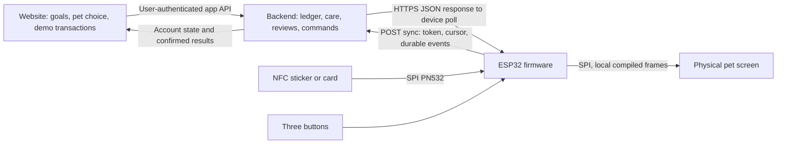

# Website ↔ physical Okanegachi

Current firmware: `firmware/`, based on website main `17df40f` and the earlier v1 device schemas. The physical screen renders the pet; the browser is its companion dashboard. The website's `okanegotchi.demo-letter.v4` local mailbox is **not** a device API.



The device asks the server for updates. The server does not open an incoming connection to the device. No port forwarding, public ESP32 address, MQTT broker, paid API or LLM is needed. A food transaction becomes an `eating` command; the ESP32 loops the local eating clip for the command's duration, then returns to its care animation. PNGs never travel in sync JSON.

## One wire contract

Authoritative files: `mvp/device-sync-request.schema.json`, `device-sync-response.schema.json`, `device-error.schema.json`. Generated C++ validation uses those exact schemas. Endpoint:

```text
POST https://<20-character-project-ref>.supabase.co/functions/v1/device-api/v1/sync
Authorization: Bearer <opaque-device-token>
Content-Type: application/json
```

Use `ack_command_seq` (not `ack_seq`). All monetary values are integer cents. UUIDs are stable identifiers, dates are the specified UTC/date-only strings, and unknown additional fields fail validation. The body limits are 4,096 request bytes / 8,192 response bytes. At most 8 outgoing events and 4 commands in one response. A command queue holds four pending commands plus one active command.

Bootstrap sends `epoch:null`, cursor zero and no events. The response establishes the epoch and returns no commands; the next normal sync can retrieve them. The ESP32 saves a command cursor immediately before starting or skipping that command. Duplicate delivery does not replay an acknowledged action after reboot. A power loss between saving and the first visible pixel can lose an effect; this is not an exactly-once display guarantee.

Poll every 30 seconds, or every 2 seconds during a server-controlled demo lease. Actions may request a sync, with a one-second minimum between requests. Only one HTTP operation runs at a time. Network errors back off; HTTP 429 honors body/header retry timing. HTTP 401/403 stop until reprovision/restart; 426 reports an update requirement. A correlated, schema-valid 409 RESET_REQUIRED clears the old epoch/outbox and bootstraps again.

## Appearance amendment for the uploaded art

Send `pet_id:gator|robot|duck`, `palette:original`, `accessory:none`, `asset_version:1`. The schema retains the old IDs/colors for transitional readers, but this build's actual art is the three current presets in original colors. Do not offer legacy pets, recoloring or clothing in the live UI. The renderer has layers/anchors and an optional custom catalog compiler for future art; no unapproved clothing was added to these pets.

There are 96 frames across 24 horizontal sheets. The shared manifest defines 2/4/6-frame clips and their delays. `blink`/`neutral` use idle; local `pat` uses celebrate for one second. All clips loop while selected, and a command's duration controls the return to idle/care. A new appearance is applied when the active financial animation finishes, so one animation does not switch animals halfway through.

## Team responsibilities

| Hardware firmware (implemented here) | Website/backend (still must connect live) |
|---|---|
| USB configuration and Wi-Fi reconnect | Authenticated pairing flow: issue device UUID + random opaque token; store token hash, owner and revocation state |
| HTTPS client, CA verification, bounded JSON | Deploy the device endpoint; disable gateway JWT verification **only for this function** and enforce device-token authentication in the handler |
| Persistent event outbox, stable event IDs, cursor and epoch | Transactional idempotency by device/epoch/event ID; reject reuse with a different payload; return a result only for submitted events |
| SPI LCD/PN532, buttons, tones, animation queue | Turn website demo transactions into ledger entries and ordered, expiring animation commands |
| Render current finance/goal and frozen review receipt | Compute finance/goal/care centrally; create a five-minute review receipt containing the exact snapshot shown |
| Hold B sends `checkin_completed` with that review ID | Validate ownership, expiry and one-time receipt use; only then update care/window/streak and optionally enqueue revive |
| A visibly separate local demo mode | Implement live demo lease (15 minutes), reset/epoch handling, rate limits and device presence |

Do not send Supabase service-role keys, user JWTs, bank credentials, merchant descriptions, NFC UIDs or card numbers to the ESP32. USB setup accepts a project ref, device UUID, opaque token and Wi-Fi credentials. NVS is ordinary local storage, not a production secure enclave. Reprovisioning changes the binding and clears the previous account's cached runtime state.

The web app's camelCase local configuration must be translated by the backend into the snake_case v1 response. Enforce device limits before saving: pet name 24 Unicode characters, goal name 32, timezone 64; cents ≤2,147,483,647. The small LCD font displays unsupported glyphs as `?`, while JSON retains valid Unicode.

Keep `state_version` changes meaningful: pet/goal/finance/care-stage/review changes. Do not increment it solely for a refreshed `server_time` or continuously advancing elapsed timer; that needlessly wears device flash. The firmware updates volatile state on every valid response but caches meaningful version changes.

## Check-in, ghost and simulated money

Care is server-owned: content → needs_checkin → sleepy → ghost at the agreed 12/24/48 connected-hour thresholds. Gaps over 90 seconds do not accrue care time. The backend handles the user's timezone and AM/PM windows; the device freezes cached care offline. An accepted spending review revives a ghost. No actual savings or transactions are deleted, and playing/petting does not count as a financial check-in.

Baseline demo: spent $25 / budget $100; saved $50 / goal $100. Food adds $12.50 expense and eating for 8 seconds. Ride adds $18 and traveling for 8 seconds. Savings adds $10 to the goal, excludes it from spending, and celebrates for 8 seconds. A neglect control sets ghost; a confirmed review revives for 2 seconds. Real banking integration is not needed for this MVP.

`DemoServer` implements those scenarios as an isolated, in-process test double. The cloud build cannot activate that server through the network or serial demo commands. It does **not** implement production database persistence, account security, timezone scheduling, demo leases or all backend business rules. It is not a deployable backend.

## NFC

Program one English NDEF Text record on a NTAG213/215/216 sticker:

```text
okanegachi:demo:v1:food
okanegachi:demo:v1:ride
okanegachi:demo:v1:savings
okanegachi:demo:v1:review
```

Choose one line per sticker. Do not make the tags read-only until tested. The bounded parser expects the small record within the first 144 user bytes. The SPI driver checks ATQA/SAK, GET_VERSION and capability container before reading user pages 4–39; it never writes tags or accesses authentication/configuration pages. It rearms only after at least 500 ms of confirmed absence; reader errors are not absence.

Food/ride/savings stickers send a server event only with fresh demo authorization (last successful sync within 10 seconds). An intent awaiting refresh expires after 10 seconds. The server changes money and sends the command; the tag does not fabricate a local purchase. Generic supported **Type A** cards only request a spending review; no EMV application or payment data is read. Type B cards, phone wallets and every credit-card model are not guaranteed for the demo. The three buttons always provide a review path.

The reader follows [NXP's PN532 host protocol](https://www.nxp.com/docs/en/user-guide/141520.pdf) and [NTAG21x memory/version definitions](https://www.nxp.com/docs/en/data-sheet/NTAG213_215_216.pdf?pspll=1). Transcript tests verify software framing, bounds and error recovery; physical RF behavior remains a bench test.
